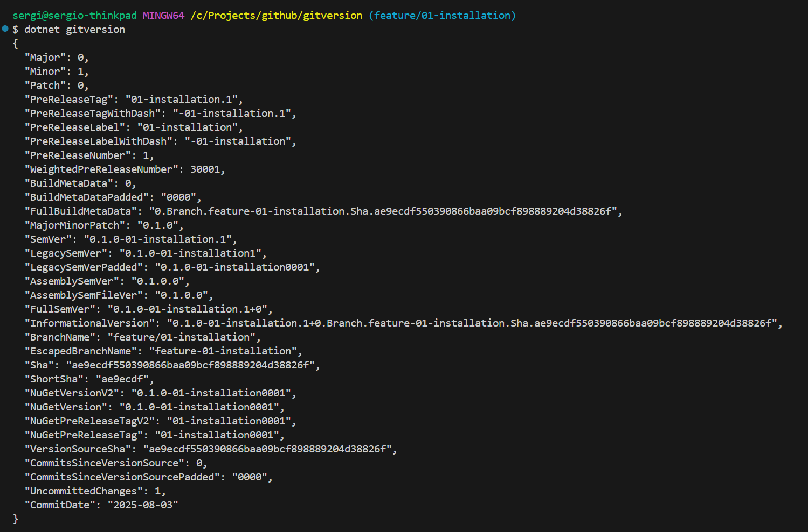

# GitVersion sample repository

GitVersion is a tool that use the git repository history to calculate a [Semantic Version Number](https://semver.org/), this version number generated can be used for different purposes, such as:

1. Continous integration server pipeline like Azure DevOps or GitHub actions.
2. Stamping a version number to the compiled assemblies.
3. Stamping a version number on artifacts.
4. Expose the version number to set the build version.


These are just a few examples how GitVersion can make easy your day to day.

In this example you will learn how to configurate a GitHub Workflow to use the version calculated based on the commit history. 

# GitVersion installation

First thing first, Let's install GitVersion locally using dotnet cli. If you do not have dotnet cli installed you can install it from the [Official Microsoft dotnet site](https://dotnet.microsoft.com/en-us/download)

To install git version run the following command

```
dotnet tool install --global GitVersion.Tool --version 6.3.0
```

Alternatively, if you are using Mac, you can install it using homebrew

```
brew install gitversion
```

# Using GitVersion from command line

Once installed, you can use GitVersion directly from the command line in the root of your repository using the following command

```
dotnet gitversion
```



# GitVersion configuration

GitVersion has a default configuration that can be shown by executing the followin command

```
dotnet gitversion /showConfig
``` 

This configuration is in YAML format. This configuration is the used when GitVersion is executed. However, this configuration can be override with a configuration file on the root of the repository.

To read more about the [gitversion configuration](https://gitversion.net/docs/reference/configuration) please refer to the official gitversion configuration documentation

## GitVersion configuration file

As we mention, the gitversion default configuration can be overrided by creating a configuration file named GitVersion.yml in the root of the repository and configure it according with your git flow requirements. The folowing GitVersion file is the default configuration for GitVersion 6.3.0.

```

assembly-versioning-scheme: MajorMinorPatch
assembly-file-versioning-scheme: MajorMinorPatch
tag-prefix: '[vV]?'
version-in-branch-pattern: (?<version>[vV]?\d+(\.\d+)?(\.\d+)?).*
major-version-bump-message: \+semver:\s?(breaking|major)
minor-version-bump-message: \+semver:\s?(feature|minor)
patch-version-bump-message: \+semver:\s?(fix|patch)
no-bump-message: \+semver:\s?(none|skip)
tag-pre-release-weight: 60000
commit-date-format: yyyy-MM-dd
merge-message-formats: {}
update-build-number: true
semantic-version-format: Strict
strategies:
- Fallback
- ConfiguredNextVersion
- MergeMessage
- TaggedCommit
- TrackReleaseBranches
- VersionInBranchName
branches:
  develop:
    mode: ContinuousDelivery
    label: alpha
    increment: Minor
    prevent-increment:
      when-current-commit-tagged: false
    track-merge-target: true
    track-merge-message: true
    regex: ^dev(elop)?(ment)?$
    source-branches:
    - main
    is-source-branch-for: []
    tracks-release-branches: true
    is-release-branch: false
    is-main-branch: false
    pre-release-weight: 0
  main:
    label: ''
    increment: Patch
    prevent-increment:
      of-merged-branch: true
    track-merge-target: false
    track-merge-message: true
    regex: ^master$|^main$
    source-branches: []
    is-source-branch-for: []
    tracks-release-branches: false
    is-release-branch: false
    is-main-branch: true
    pre-release-weight: 55000
  release:
    mode: ManualDeployment
    label: beta
    increment: Minor
    prevent-increment:
      of-merged-branch: true
      when-current-commit-tagged: false
    track-merge-target: false
    regex: ^releases?[\/-](?<BranchName>.+)
    source-branches:
    - main
    - support
    is-source-branch-for: []
    tracks-release-branches: false
    is-release-branch: true
    is-main-branch: false
    pre-release-weight: 30000
  feature:
    mode: ManualDeployment
    label: '{BranchName}'
    increment: Inherit
    prevent-increment:
      when-current-commit-tagged: false
    track-merge-message: true
    regex: ^features?[\/-](?<BranchName>.+)
    source-branches:
    - develop
    - main
    - release
    - support
    - hotfix
    is-source-branch-for: []
    is-main-branch: false
    pre-release-weight: 30000
  pull-request:
    mode: ContinuousDelivery
    label: PullRequest{Number}
    increment: Inherit
    prevent-increment:
      of-merged-branch: true
      when-current-commit-tagged: false
    track-merge-message: true
    regex: ^(pull-requests|pull|pr)[\/-](?<Number>\d*)
    source-branches:
    - develop
    - main
    - release
    - feature
    - support
    - hotfix
    is-source-branch-for: []
    pre-release-weight: 30000
  hotfix:
    mode: ManualDeployment
    label: beta
    increment: Inherit
    prevent-increment:
      when-current-commit-tagged: false
    regex: ^hotfix(es)?[\/-](?<BranchName>.+)
    source-branches:
    - main
    - support
    is-source-branch-for: []
    is-release-branch: true
    is-main-branch: false
    pre-release-weight: 30000
  support:
    label: ''
    increment: Patch
    prevent-increment:
      of-merged-branch: true
    track-merge-target: false
    regex: ^support[\/-](?<BranchName>.+)
    source-branches:
    - main
    is-source-branch-for: []
    tracks-release-branches: false
    is-release-branch: false
    is-main-branch: true
    pre-release-weight: 55000
  unknown:
    mode: ManualDeployment
    label: '{BranchName}'
    increment: Inherit
    prevent-increment:
      when-current-commit-tagged: true
    regex: (?<BranchName>.+)
    source-branches:
    - main
    - develop
    - release
    - feature
    - pull-request
    - hotfix
    - support
    is-source-branch-for: []
    is-main-branch: false
ignore:
  sha: []
mode: ContinuousDelivery
label: '{BranchName}'
increment: Inherit
prevent-increment:
  of-merged-branch: false
  when-branch-merged: false
  when-current-commit-tagged: true
track-merge-target: false
track-merge-message: true
commit-message-incrementing: Enabled
regex: ''
source-branches: []
is-source-branch-for: []
tracks-release-branches: false
is-release-branch: false
is-main-branch: false

```


## Update behaviour 

You might probably have to modify your GitVersion.yml file depending of the git flow requirements. For example on the configuration of this repository you will find that main mode is configured as ManualDeployment which means that the version remain on the same pre-released version until it has been deployed dedicatedly, [Refer to the documentation for mure information](https://gitversion.net/docs/reference/modes/).

# Using GitVersion with GitHub Workflows

This document does not intend to explain how Github Workflows works but show you how to use GitVersion with GitHub Workflows as simple as possible.

THe following Workflow contains two jobs, the first one is the Setup job which is the job responsable to execute GitVersion, the second one is the build jobd which show how to use the differente output variables from the Setup job.

```

name: GitVersion - PR

env:
  GITVERSION_VERSION: 6.3.0

on:
  pull_request:
    types: [opened, synchronize, reopened]    
    branches:
      - main

jobs:
  setup:
    runs-on: ubuntu-latest
    outputs:
      # Define job output variables
      GitVersion_BranchName: ${{ steps.gitversion_step.outputs.GitVersion_BranchName }}
      GitVersion_SemVer: ${{ steps.gitversion_step.outputs.GitVersion_SemVer }}
      GitVersion_FullSemVer: ${{ steps.gitversion_step.outputs.GitVersion_FullSemVer }}
      GitVersion_MajorMinorPatch: ${{ steps.gitversion_step.outputs.GitVersion_MajorMinorPatch }}
    steps:
      - name: Checkout
        uses: actions/checkout@v4
        with:
          fetch-depth: 0

      - name: Install GitVersion
        uses: gittools/actions/gitversion/setup@v4.0.1
        with:
          versionSpec: ${{ env.GITVERSION_VERSION }}

      - name: Execute GitVersion
        id: gitversion_step # step id used as reference for output values
        uses: gittools/actions/gitversion/execute@v4.0.1
      
  build:
    runs-on: ubuntu-latest
    # 
    needs: [ setup ]
    env:
      # Define job environment variables that maps from setup job
      GitVersion_BranchName: ${{ needs.setup.outputs.GitVersion_BranchName }}
      GitVersion_SemVer: ${{ needs.setup.outputs.GitVersion_SemVer }}
      GitVersion_FullSemVer: ${{ needs.setup.outputs.GitVersion_FullSemVer }}
      GitVersion_MajorMinorPatch: ${{ needs.setup.outputs.GitVersion_MajorMinorPatch }}
    steps:
      - name: Use own job variables that maps from setup job (pwsh)
        shell: pwsh
        run: |
          echo "GitVersion BranchName         : $env:GitVersion_BranchName"
          echo "GitVersion SemVer             : $env:GitVersion_SemVer"
          echo "GitVersion FullSemVer         : $env:GitVersion_FullSemVer"
          echo "GitVersion MajorMinorPatch    : $env:GitVersion_MajorMinorPatch"

      - name: Use own step variables that maps from own job variables (pwsh)
        shell: pwsh
        env:
          GitVersion_BranchName_local: ${{ env.GitVersion_BranchName }}
          GitVersion_SemVer_local: ${{ env.GitVersion_SemVer }}
          GitVersion_FullSemVer_local: ${{ env.GitVersion_FullSemVer }}
          GitVersion_MajorMinorPatch_local: ${{ env.GitVersion_MajorMinorPatch }}
        run: |
          echo "BranchName                    : $env:GitVersion_BranchName_local"
          echo "SemVer                        : $env:GitVersion_SemVer_local"
          echo "FullSemVer                    : $env:GitVersion_FullSemVer"  
          echo "MajorMinorPatch               : $env:GitVersion_MajorMinorPatch_local"

      - name: Use own step variables that maps from setup job output variables (pwsh)
        shell: pwsh
        env:
          GitVersion_SemVer_local: ${{ needs.setup.outputs.GitVersion_SemVer }}
          GitVersion_MajorMinorPatch_local: ${{ needs.setup.outputs.GitVersion_MajorMinorPatch }}
        run: |
          echo "SemVer            : $env:GitVersion_SemVer_local"
          echo "MajorMinorPatch   : $env:GitVersion_MajorMinorPatch_local"

      - name: Use setup job output variables directly (pwsh)
        shell: pwsh
        run: |
          echo "SemVer            : ${{ needs.setup.outputs.GitVersion_SemVer }}"
          echo "MajorMinorPatch   : ${{ needs.setup.outputs.GitVersion_MajorMinorPatch }}"       

      - name: Use own job variables that maps from setup job  (bash)
        shell: bash
        run: |
          echo "SemVer            : $GitVersion_SemVer"
          echo "MajorMinorPatch   : $GitVersion_MajorMinorPatch"

      - name: Use own step variables that maps from own job variables (bash)
        shell: bash
        env:
          GitVersion_SemVer_local: ${{ env.GitVersion_SemVer }}
          GitVersion_MajorMinorPatch_local: ${{ env.GitVersion_MajorMinorPatch }}
        run: |
          echo "SemVer            : $GitVersion_SemVer_local"
          echo "MajorMinorPatch   : $GitVersion_MajorMinorPatch_local"          

      - name: Use own step variables that maps from setup job output variables (bash)
        shell: bash
        env:
          GitVersion_SemVer_local: ${{ needs.setup.outputs.GitVersion_SemVer }}
          GitVersion_MajorMinorPatch_local: ${{ needs.setup.outputs.GitVersion_MajorMinorPatch }}
        run: |
          echo "SemVer            : $GitVersion_SemVer_local"
          echo "MajorMinorPatch   : $GitVersion_MajorMinorPatch_local"
        
      - name: Use setup job output variables directly (bash)
        shell: bash
        run: |
          echo "SemVer            : ${{ needs.setup.outputs.GitVersion_SemVer }}"
          echo "MajorMinorPatch   : ${{ needs.setup.outputs.GitVersion_MajorMinorPatch }}"    

```


